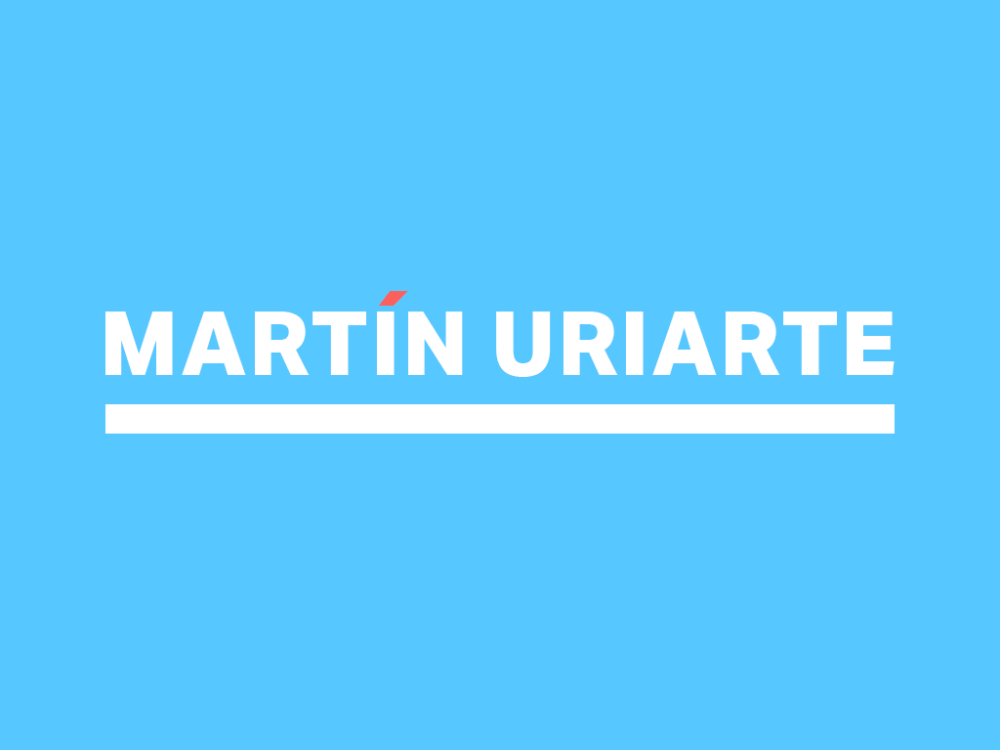

# The Hero's Journey &nbsp;&nbsp;

> My self-improvement repo

So to get GitHub recognition for the work I put in, this is a repo holding some of my work towards becoming a top-tier Software Engineer.

**[LinkedIn](https://wwww.linkedin.com/in/themartinuriarte)**

 

## Contents

- [About](#about)
- [Communication](#communication)
- [General Assembly](https://github.com/TheMartinUriarte/the-heros-journey/tree/master/general-assembly)
- [JavaScript](https://github.com/TheMartinUriarte/the-heros-journey/tree/master/javascript)
- [Bugs and Feedback](#bugs)

## About

The Hero's Journey is literally that. People can't fly or phase thru walls but people can inspire others, can save others, and can significantly improve the lives of others. This is my way of becoming a hero -- so I am doing my best to become an amazing developer who can show a bright future to those who are currently growing up in difficult situations.

## Communication

Always a fan of human interaction, feel free to reach out!

- Twitter: [@MrMartinUriarte](https://twitter.com/MrMartinUriarte)
- LinkedIn: [/in/TheMartinUriarte](https://www.linkedin.com/in/themartinuriarte/)
- Instagram: [@TheMartinUriarte](https://www.instagram.com/themartinuriarte/)

## Bugs and Feedback

Any feedback or discussion is absolutely welcomed so please use [GitHub Issues](https://github.com/projectTitle/issues)!